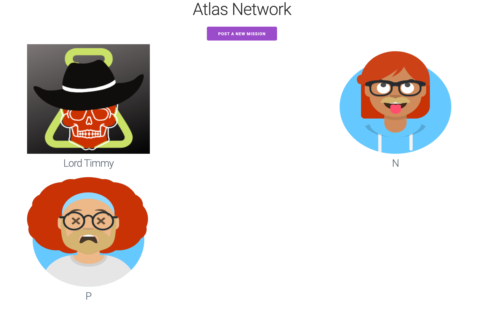
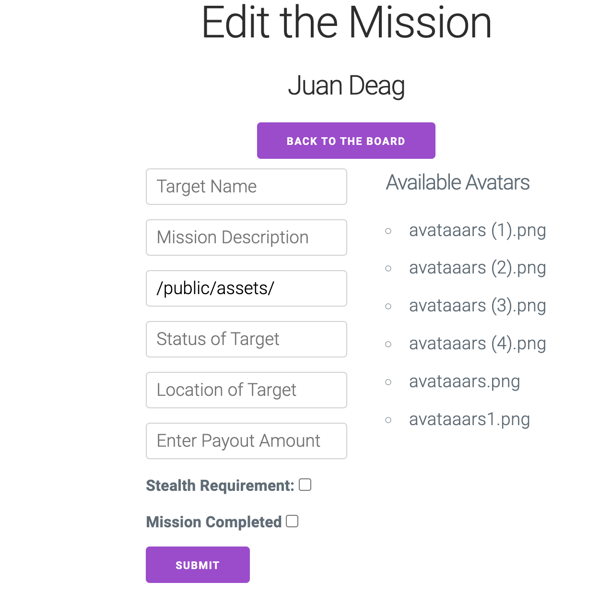

## Routes of the application
| Name      | Endpoint | HTTP Method |
| ----------- | ----------- | ----------- |
| INDEX      | /missions       | GET       |
| NEW   | /missions/new        | GET       |
| CREATE   | /missions        | POST       |
| SHOW   | /missions/:id        | GET       |
| EDIT   | /missions/:id/edit        | GET       |
| UPDATE   | /missions/:id        | PUT       |
| DESTROY   | /missions/:id        | DELETE       |

## Model table
| Property      | Type |
| ----------- | ----------- |
| Target      | String      |
| Image   | String       |
| Status   | String       |
| Location   | String       |
| Payout   | Number       |
| Informants   | Array       |
| Weapons   | Array        |
| Stealth_Requirement | Boolean     |

![New Page] (assets/NEW.png)
